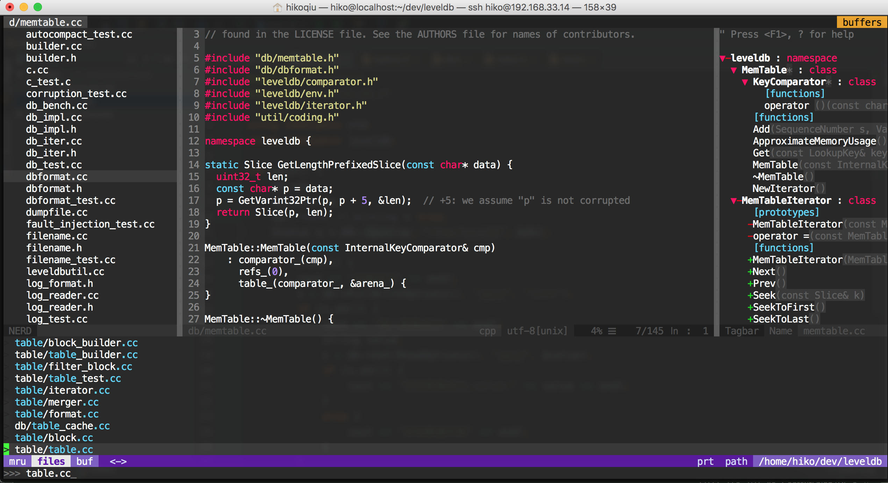

### vim config for c/c++ development.



### Dependences

#### 1. Bundle for vim plugin management.

#### 2. Ctags for generate cpp std keywords.

#### 3. Many plugin installed by Bundle.

````

Get awesome vim-plugin from: [http://vimawesome.com/](http://vimawesome.com/)

````
